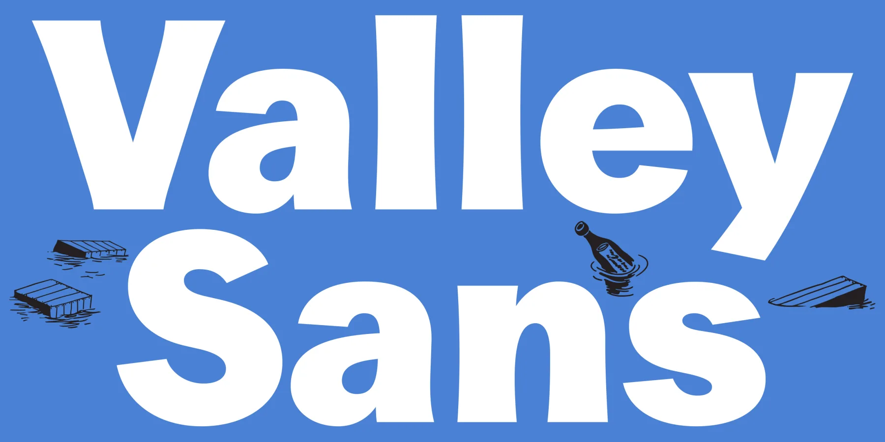
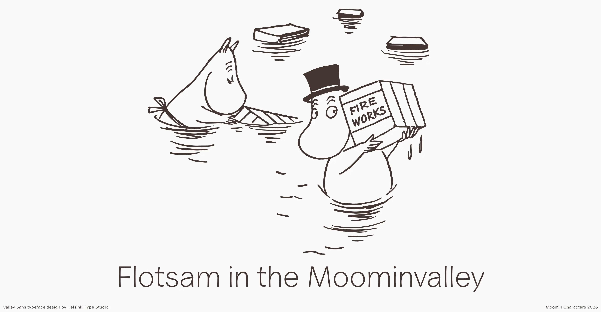
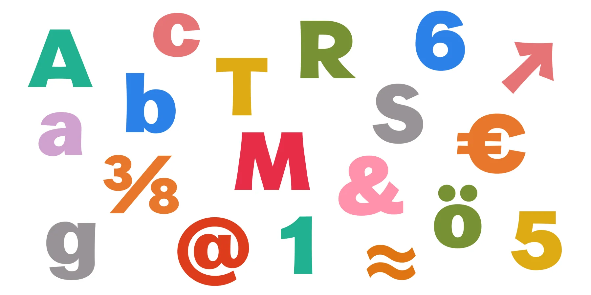
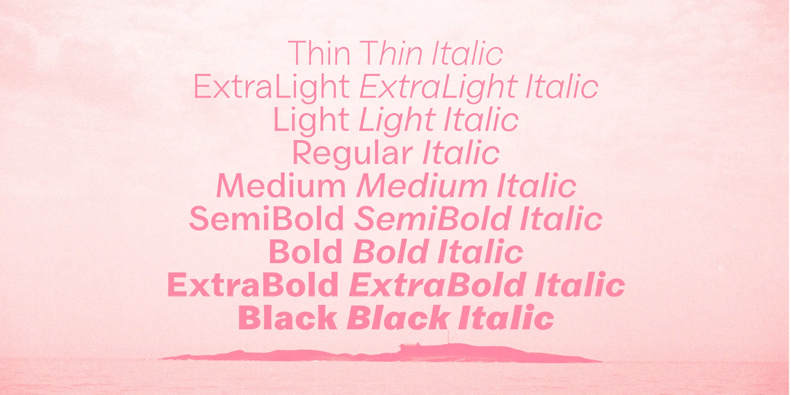

# Valley Sans

Valley Sans is a clear, versatile typeface developed for the Moomin Company.

The design draws from Tove Jansson's original lettering, the typographic landscape of her era, and details from life in the Finnish archipelago.

The Moomins, beloved characters created by Tove Jansson, are known for wit, warmth, and charm. Valley Sans translates that spirit into a contemporary type system for brand communication, publishing, and digital interfaces while preserving a distinct connection to the Moomin visual world.



Jansson produced a plethora of lettering in many styles. However the sans-serif lettering is always uppercase. The style is sturdy and often includes slightly flared terminals, which gave a very clear direction for Valley Sans. To build a complete contemporary family, the lowercase and broader stylistic system were complemented with compatible historical models. The design team focused on late-1800s American modern gothic typefaces, chosen for their suitable warmth, practicality, and expressive charm, and also because of a surprising oblique connection to the Moomins. In the Finnish archipelago, where Jansson spent most summers, cargo crates and other branded pieces of driftwood have washed ashore over time. This inspired the idea of flotsam, where distant typographic influences arrive by sea and settle into local visual culture, becoming part of the conceptual foundation of Valley Sans.

The result is a typeface rooted in heritage and storytelling, designed for clarity, rhythm, and usability across styles.



Valley Sans is delivered as a variable-weight family, covering styles from Thin to Black in both roman and italic. This structure provides a broad expressive range while keeping behaviour consistent across editorial and interface contexts.

The family is currently developed for Latin-script use and is intended to support a wide range of contemporary brand and publishing needs in digital and print environments.



## Credits and license

Valley Sans was designed for Moomin Characters by Niklas Ekholm in collaboration with Lari Mörö at Helsinki Type Studio.

Images courtesy of Moomin Characters Ltd.

This Font Software is licensed under the SIL Open Font License, Version 1.1.  
See `OFL.txt` and [https://openfontlicense.org](https://openfontlicense.org)

## Further development

- Add **`minisite_url`** to `METADATA.pb` once a public specimen URL exists.

### Specimen minisite

Run the local specimen from **`documentation/`**:

```bash
cd documentation
npm install
npm run dev
```

Details: [documentation/README.md](documentation/README.md) and [documentation/MINISITE_PLAN.md](documentation/MINISITE_PLAN.md).